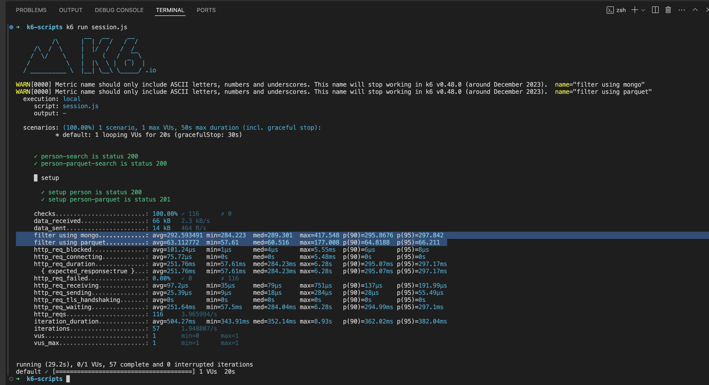
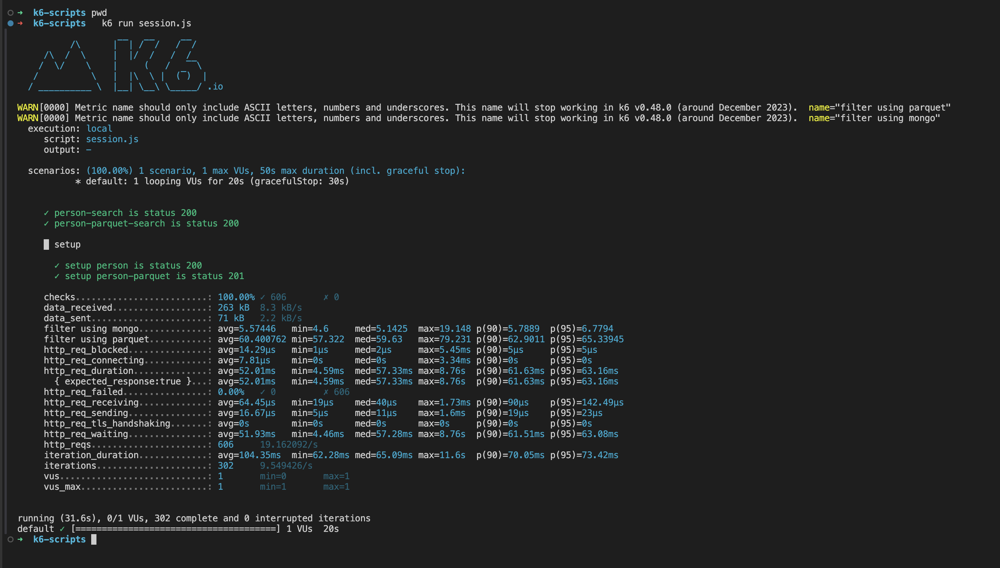
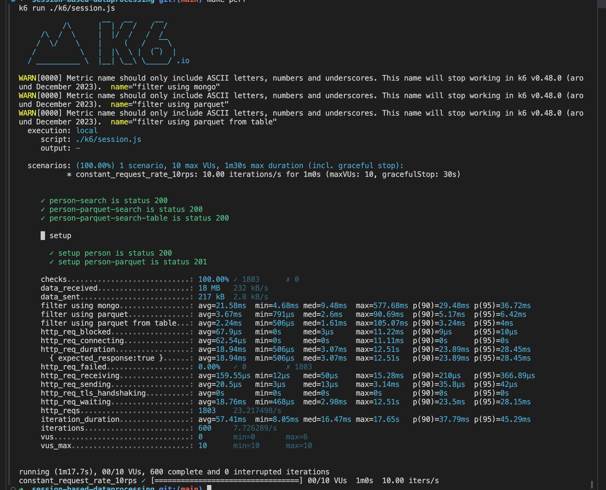

# Intro
This repo is a POC that looks at setting up a session based table using MongoDB to do some processing as long as the 
data resides in the database. We use [TTL Indexes](https://www.mongodb.com/docs/manual/core/index-ttl/) to ensure the data expires.

This repo also includes doing the same level of data processing using a [Apache Parquet](https://parquet.apache.org/) directly and leveraging Apache Arrow implementations (In this case, [DuckDB](https://duckdb.org/docs/data/parquet/overview.html))
to read in the right columns directly into memory and processing it.
This means the files can persist in Cloud Storage and we can leverage Parquet's compression and metadata calculations for lookups.

This is a useful workaround if you dont want data to live in your infra but in cheaper blob storages.
The code also has an example (commented out) where the query directly reads from a public url.
We are able to filter based on the query from 1M records under 5secs.
## How to run
You can build the containers and the get the service running using:
```
make buildup
```
This runs the container in as a foreground process.
Please use `-d` option to the `buildup` rule in Makefile to ensure it runs as a daemon.
Once you are done, clean up can be done using
```
make clean
```


## How to login to mongosh to check contents
1. We first attach a shell to the mongodb container of the service
2. We then initiate `mongosh` command
```
# mongosh
Current Mongosh Log ID: 664ce644383fd660af99ea71
Connecting to:          mongodb://127.0.0.1:27017/?directConnection=true&serverSelectionTimeoutMS=2000&appName=mongosh+2.2.5
Using MongoDB:          7.0.9
Using Mongosh:          2.2.5

For mongosh info see: https://docs.mongodb.com/mongodb-shell/

test> 
```
3. We then switch to `admin` and authenticate by doing:
```
test> use admin
switched to db admin
admin> db.auth("rootuser", "rootpass")
{ ok: 1 }
admin>
```
4. we can then finally switch to our DB and then execute commands
```bash
admin> use mydatabase
switched to db mydatabase
mydatabase> show collections
persons
mydatabase> db.persons.getIndexes()
[
  { v: 2, key: { _id: 1 }, name: '_id_' },
  {
    v: 2,
    key: { createdAt: 1 },
    name: 'createdAt_1',
    expireAfterSeconds: 600
  }
]
mydatabase> db.persons.find()
[
  {
    _id: '4b6af7c5-c124-42d5-9538-5d0935fc2f82',
    name: 'name0',
    city: 'Toronto',
    age: 21,
    createdAt: ISODate('2024-05-21T18:15:50.377Z')
  }
]
```

## k6 Comparision between mongo and parquet
### Mongo without Indexes in comparision with Parquet

### Mongo with Indexes in comparision with Parquet

### Mongo with Indexes, along with Parquet via a file and parquet loaded into the DB at a 10 rps pinged via 10 VUs


## TODOs
- Make a new endpoint to filter data using a `POST` and keep table creations as a separate one


